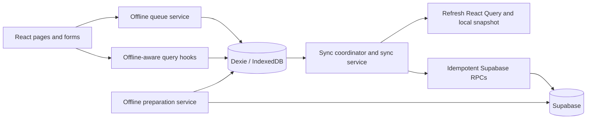
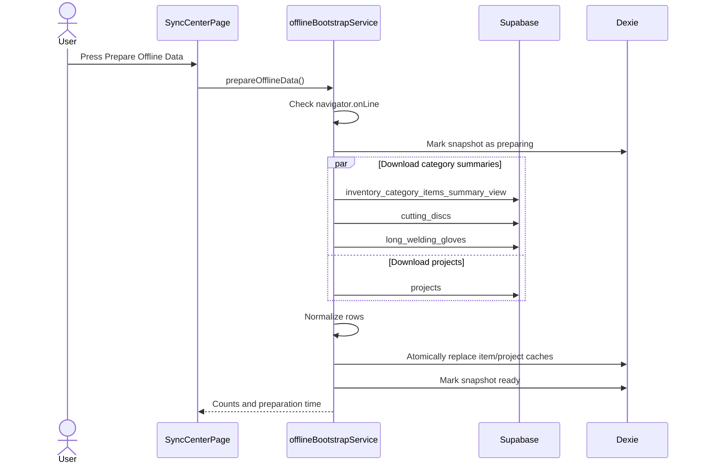
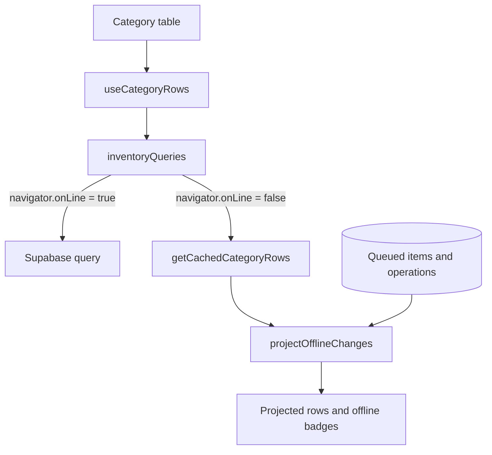
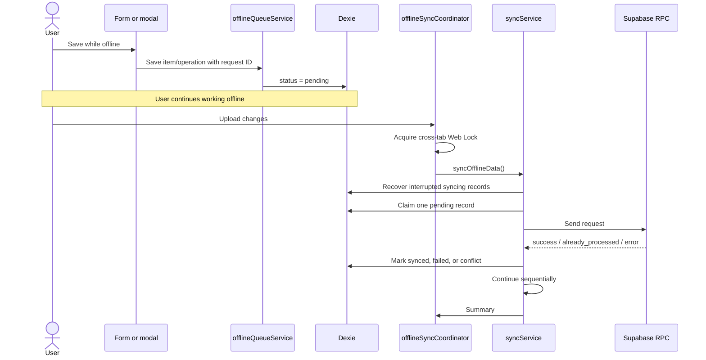

# Offline Mode, Synchronization, Cache, and Performance Plan

## Purpose

This document describes the implemented offline mode, the files involved in each flow, its deliberate limitations, and the performance/cache work delivered with it. The original phased plan is retained below as a reusable maintenance and test reference.

The intended business workflow is:

1. While connected to Wi-Fi, the user prepares a complete offline snapshot.
2. The user keeps the application open, turns Wi-Fi off, and works locally.
3. All supported changes are saved in the browser database.
4. When work is finished, the user reconnects and explicitly uploads the queued changes.
5. The application reports uploaded, rejected, and attention-required changes without duplicating stock operations.

## Implementation status (2026-08-09)

Phases 0 through 4 are implemented. Phase 5, offline reload/reopen through a service worker, remains intentionally deferred.

| Area | Implemented result |
| --- | --- |
| Offline snapshot | Inventory, projects, active employees, and active suppliers are replaced atomically in IndexedDB. |
| Offline stock work | Add, issue, adjust, create-item, and edit-item changes can be queued. Party IDs and display-name snapshots are retained. |
| Upload behavior | Reconnection only announces pending work. Upload starts only from the Sync Center after explicit confirmation. |
| Reliability | Stable request IDs, server idempotency, dependency blocking/release, interrupted-upload recovery, and attention-required party resolution are implemented. |
| Post-upload work | Only affected local rows and React Query keys are refreshed; the entire offline snapshot is not downloaded. |
| Deployment cache | HTML and `version.json` are not stored; fingerprinted assets are immutable; a version banner offers a safe user-confirmed reload. |
| Frontend performance | Secondary routes and XLSX are lazy-loaded, and row-hover prefetch waits 250 ms and cancels on mouse leave. |
| Dashboard performance | The production dashboard response is 617,945 bytes for 1,941 rows and executed in about 53 ms in the final warm-buffer check. |
| Live freshness | One Supabase Realtime channel coalesces relevant database changes and performs targeted query invalidation. |

The measured eager JavaScript is approximately 212 KB gzip, down from about 420 KB gzip before route splitting. XLSX is now an on-demand chunk of approximately 141 KB gzip.

## Operator workflow

### Before turning Wi-Fi off

1. Open **Sync Center** while Supabase is reachable.
2. Resolve or upload any old pending, failed, blocked, conflicting, or attention-required work.
3. Press **Prepare Offline Data**.
4. Confirm inventory, project, employee, and supplier counts are present and the page says **Ready to disconnect**.
5. Keep the application tab open, then disconnect Wi-Fi.

### While offline

- Use the prepared inventory, projects, employees, and suppliers.
- Add/issue/adjust stock or create/edit supported items normally; each change is written immediately to IndexedDB.
- Do not reload or close the tab. A service worker is deliberately not installed, so an offline app-shell reload is not guaranteed.
- Party creation/editing, delete, return, and import remain online-only.

### After reconnecting

1. Wait for the banner to say that the server is reachable and changes are ready.
2. Open **Sync Center** and press **Upload Changes**. Reconnection never uploads automatically.
3. Review the final summary.
4. Resolve `needs_attention` operations by choosing a valid employee/supplier, then retry and press upload again.
5. Resolve edit conflicts or explicitly discard them. Unresolved records are never removed by automatic cleanup.

## Implemented file flow

### Prepare an offline session

```text
SyncCenterPage
  -> offlineBootstrapService.prepareOfflineData()
     -> connectivityService.requireSupabaseReachability()
     -> Supabase inventory/projects/employees/suppliers queries
     -> offlineDb transaction
        -> cached_inventory_items
        -> cached_projects
        -> cached_parties
        -> offline_cache_metadata
  -> useOfflineCacheStatus() updates the visible counts and timestamp
```

The service refuses to replace a snapshot while unresolved local work exists. All required datasets are fetched before the Dexie write transaction, so a partial network failure leaves the last known-good data intact.

### Read data online or offline

```text
Inventory/category UI -> inventoryQueries -> server query
                                      \-> transport failure -> offlineCache
Projects UI           -> projectQueries   -> server query or cached_projects
PartyCombobox          -> partiesService  -> server search or cached_parties
Offline queue          -> offlineCache.projectOfflineChanges() -> projected balances/badges
```

`navigator.onLine` is only an initial signal. `connectivityService.ts` performs a lightweight Supabase reachability probe, and server transport failures fall back to prepared local data.

### Save offline work

```text
Category/item-details form
  -> operationsService
     -> offlineQueueService
        -> offline_items or offline_operations
           (stable requestId + item dependency + party IDs/name snapshots)
  -> React Query/local projection updates the visible row immediately
```

For group issues, both employee IDs and name snapshots are saved. IDs remain authoritative during upload; snapshots are only for display and recovery.

### Upload offline work

```text
SyncCenterPage explicit Upload Changes
  -> offlineSyncCoordinator (same-tab guard + Web Lock)
  -> syncService
     -> offlineQueueService.recoverInterruptedSyncs()
     -> upload new items first with idempotent request IDs
     -> release dependent blocked operations
     -> upload stock through apply_inventory_operation_with_party_rpc
     -> mark synced / failed / conflict / blocked / needs_attention
     -> refresh affected cached inventory rows
     -> invalidate only affected React Query keys
     -> cleanup old successful queue history only
```

### Receive server changes without polling storms

```text
DashboardLayout
  -> useInventoryRealtime()
     -> inventoryRealtimeService (one channel)
        -> one-second trailing coalescer
           -> targeted dashboard/category/project/alert invalidation
```

### Detect a new deployment safely

```text
Vite build -> version.json + hashed assets
Browser -> useBuildUpdate -> no-store version check
        -> BuildUpdateBanner -> user confirms reload
        -> IndexedDB is preserved, including unsynchronized work
```

## Executive decision

Keep the offline feature, but make it a controlled **offline work session** instead of treating every network loss as a complete offline-capable application.

For the first stabilization phase:

- Keep the application tab open during offline work.
- Do not add a service worker yet.
- Cache active employees and suppliers so add/issue operations can be performed offline.
- Upload only when the user presses an explicit upload button.
- Use stable request IDs and the party-aware stock RPC when uploading.
- Do not clear browser cache or IndexedDB as an update strategy.
- Do not perform a full snapshot download after every upload.

This gives the required workflow while avoiding another cache layer before synchronization is reliable.

## Important current limitation

The application has a web manifest, but it does not currently have a service worker or PWA app-shell cache. Therefore:

- Offline work is possible after the application and its data have loaded in an open tab.
- Queued data survives a normal reload because it is stored in IndexedDB.
- However, reloading or reopening the site while Wi-Fi is off is not guaranteed to work because the browser may not have the JavaScript application files available.

If offline reload/reopen becomes a hard requirement, add a service worker in a later, separate phase with strict versioning and cache invalidation tests.

## Current architecture

The feature has four main layers:



### Browser database

`src/lib/offlineDb.ts` defines the Dexie database named `offline_inventory_db`. Its current schema version is 5.

Current stores:

| Store | Purpose |
| --- | --- |
| `offline_items` | New inventory items created locally before they have server IDs. |
| `offline_operations` | Queued stock changes and item edits. |
| `cached_inventory_items` | Server inventory rows downloaded for offline reading. |
| `cached_projects` | Projects downloaded for offline selection. |
| `cached_parties` | Active employees and suppliers downloaded for offline selection. |
| `offline_cache_metadata` | Preparation state, timestamp, counts, and errors. |

Current operation states are `pending`, `syncing`, `synced`, `failed`, `conflict`, `blocked`, and `needs_attention`.

Current queued operation types are `add`, `issue`, `adjust`, and `edit_item`.

## Current preparation flow

The user prepares offline data from `src/pages/SyncCenterPage.tsx`.



`src/services/offlineBootstrapService.ts` downloads paginated data in batches of 1,000. It fetches the inventory sources, projects, active employees, and active suppliers concurrently, normalizes them, and replaces the prior cache in one Dexie transaction. If fetching fails, the previous snapshot is retained and the metadata is marked failed.

Employees and suppliers are included in the same all-or-nothing snapshot transaction.

## Current offline read flow

### Inventory lists



- `src/features/category/hooks/useCategoryRows.ts` subscribes to queued Dexie changes and combines them with the downloaded rows.
- `src/features/inventory/inventoryQueries.ts` selects Supabase or the local cache.
- `src/features/inventory/offlineCache.ts` applies queued add, issue, adjust, and edit operations in creation order to calculate projected balances.
- `src/features/category/components/CategoryTableColumns.tsx` displays offline-state badges.
- `src/features/item-details/hooks/useItemDetailsPage.ts` can use the cached projected item, but offline movement history is currently empty.

### Projects

`src/features/projects/projectQueries.ts` uses the local projects snapshot when offline.

### Employees and suppliers

Employees and suppliers use server-first search with local fallback:

- `src/services/partiesService.ts` requests active parties from Supabase while reachable and searches `cached_parties` while offline or after a transport failure.
- `src/features/parties/PartyCombobox.tsx` supports cached single and multi-party selection.
- Creating or editing a party remains disabled offline.

Stock receipt and issue operations are therefore supported offline in `src/services/operationsService.ts` after a snapshot is prepared.

## Current offline write flow

### Create item

`src/features/category/hooks/useCategoryCreate.ts` creates a temporary local code, calls `saveOfflineItem()`, and inserts the new item into the React Query cache.

### Edit item

`src/features/item-edit/EditItemModal.tsx` queues an `edit_item` operation. It records `baseUpdatedAt` so the server version can be checked during upload.

### Adjust quantity

`src/services/operationsService.ts` queues an adjustment when the browser is offline.

### Add and issue quantity

These are supported offline. The service validates employee/supplier selections and queues authoritative IDs plus display-name snapshots for later party-aware upload.

### Unsupported writes

Delete, return, employee/supplier creation or editing, and import workflows are currently online-only. They should remain online-only in the first improvement phase.

## Current queue and synchronization flow



- `src/services/offlineQueueService.ts` creates request IDs, atomically claims work, retries failed records, and recovers interrupted `syncing` records.
- `src/services/offlineSyncCoordinator.ts` prevents duplicate sync runs in the same tab and uses Web Locks to reduce duplicate work across tabs.
- `src/services/syncService.ts` uploads local items first, then operations sequentially, and invalidates inventory queries.
- `src/components/OfflineStatusBanner.tsx` announces restored connectivity and links to the Sync Center; it never starts synchronization automatically.
- `src/pages/SyncCenterPage.tsx` also provides manual synchronization, retry, and conflict-discard controls.

After synchronization, affected cached inventory rows are patched/refetched and only related query keys are invalidated. A complete snapshot is downloaded only when the user explicitly prepares one.

## Server-side idempotency

`supabase/migrations/20260721000100_make_offline_operations_idempotent.sql` adds request-ID handling to the transactional inventory operation RPC. It checks for an existing request before and after locking the row and returns `already_processed` when appropriate. This is essential when the server completed an operation but the browser lost the response.

`supabase/migrations/20260730080631_add_group_issue_allocations.sql` adds the party-aware operation wrapper and employee allocation support. This is the server contract that offline add/issue uploads should use.

Before implementation, verify that the production database has the expected current function signatures. Local and production migration histories must not be assumed to be identical, and old baseline migrations must not be reapplied blindly.

## Current capability matrix

| Feature | Offline now | Planned first phase |
| --- | ---: | ---: |
| View prepared category inventory | Yes | Yes |
| View prepared projects | Yes | Yes |
| Create inventory item | Yes | Yes, with stronger idempotency |
| Edit inventory item | Yes | Yes |
| Adjust quantity | Yes | Yes |
| Receive/add stock with supplier | No | Yes |
| Issue stock to one/multiple employees | No | Yes |
| Search prepared employees/suppliers | No | Yes |
| Create/edit employees or suppliers | No | No; require online mode |
| View movement history | No | Not in first phase |
| Delete item | No | No; require online mode |
| Return operation | No | No; require online mode |
| Dashboard and reports | Not reliably | No; show clear offline state |
| Reload/reopen application without Wi-Fi | Not guaranteed | Not in first phase |

## Problems addressed by this implementation

### 1. Network detection is too weak

The code mainly relies on `navigator.onLine`. This only indicates whether the device has a network interface; it does not prove that Supabase is reachable. The application can therefore attempt a server query, fail, and skip the valid local snapshot.

### 2. Employees and suppliers are missing from the snapshot

This prevents the core receipt and issue workflows from operating offline.

### 3. Upload starts automatically

Automatic upload on an `online` browser event does not match the required workflow. A weak or temporary connection can start an upload before the user is ready.

### 4. Party data is missing from queued operations

The offline queue and uploader need to persist and transmit supplier/employee IDs, multiple employee IDs, and display-name snapshots. The current upload path uses an older operation RPC that does not carry those party fields.

### 5. New-item creation has a request-ID gap

Queued operations have a stable request ID. The local new-item record should have equivalent idempotency protection so a lost response cannot create a duplicate on retry.

### 6. Dependencies are not represented explicitly

An operation against a new local item must wait until that item obtains a server ID. If item creation fails and is later retried, its dependent operations should resume automatically instead of requiring multiple manual retries.

### 7. Synchronization performs an expensive full refresh

The complete snapshot is downloaded after every sync. This consumes time and bandwidth and can make the interface feel frozen.

### 8. Completed queue records grow indefinitely

Synced items and operations are retained without a documented cleanup policy.

### 9. Cache/update behavior is not explicit

There is no Vercel cache policy or application-version handshake. Users needing `Ctrl + Shift + R` indicates that HTML/version freshness and update notification must be made predictable.

## Target offline session design

### State model

Use one state model across the banner and Sync Center:

```text
not_ready -> preparing -> ready -> working_offline -> ready_to_upload
                                                   -> uploading
                                                   -> needs_attention
                                                   -> uploaded
```

The UI should always show:

- Current connection state: server reachable, browser offline, or server unreachable.
- Snapshot status and preparation time.
- Cached counts for inventory, projects, employees, and suppliers.
- Pending, failed, conflicting, and blocked queue counts.
- Whether upload is currently allowed.

### Prepare offline session

When the user presses **Prepare Offline Session**:

1. Probe actual Supabase reachability.
2. Check unresolved pending, failed, conflict, or blocked records from the previous session.
3. Require those records to be uploaded or explicitly resolved before replacing the working snapshot.
4. Download inventory, projects, active employees, and active suppliers.
5. Write the complete snapshot atomically.
6. Show counts, timestamp, and a clear **Ready to disconnect** result.

If any required dataset fails, keep the previous known-good snapshot rather than partially replacing it.

### Work offline

- Read only from the prepared snapshot.
- Save all supported writes to Dexie immediately.
- Project queued stock changes into category rows.
- Search employees and suppliers locally.
- Keep party creation/editing disabled with a clear instruction to reconnect and prepare again.
- Display an obvious local-only badge on every unsynchronized record.

### Upload completed work

When connectivity returns, show **Connection restored — N changes ready to upload**. Do not start uploading automatically.

When the user presses **Upload Changes**:

1. Probe Supabase reachability.
2. Acquire the cross-tab sync lock.
3. Recover interrupted uploads.
4. Upload new items first.
5. Resolve local item IDs to server IDs.
6. Upload edits and stock operations with their original request IDs.
7. Use the party-aware RPC for receipt/issue operations.
8. Mark each record independently as synced, failed, conflict, or needs attention.
9. Refresh only affected server/local rows.
10. Show a final summary and keep unresolved work visible.

## Adding employees and suppliers to offline mode

### Scope

The first phase should cache active parties for selection only. It should not support offline creation, editing, activation, or deactivation of parties.

### Dexie schema change

Add a version 5 store such as `cached_parties` with fields equivalent to:

```ts
type CachedParty = {
  id: string;
  kind: "employee" | "supplier";
  name: string;
  normalizedName: string;
  isActive: boolean;
  cachedAt: string;
};
```

Recommended indexes:

- `id`
- `[kind+id]`
- `kind`
- `[kind+normalizedName]`

Store only the fields required for offline display and selection. Do not copy the entire remote party record without a demonstrated need.

### Snapshot changes

Extend `src/services/offlineBootstrapService.ts` to download active employees and suppliers as part of the same preparation transaction. Extend the cache metadata and `src/hooks/useOfflineCacheStatus.ts` to report both counts.

### Selector changes

Extend `src/services/partiesService.ts` with local cached-party search. Update `src/features/parties/PartyCombobox.tsx` and its multi-employee selector so that:

- Online/server reachable: use the current server search.
- Offline/server unreachable with a ready snapshot: search IndexedDB.
- Snapshot missing: show **Prepare offline data while connected**.
- Creating a new party remains disabled offline.

### Queue contract

Persist these fields with the queued operation where applicable:

- `supplierId`
- `supplierName` snapshot
- `employeeId`
- `employeeName` snapshot
- `employeeIds`
- employee-name snapshots for multi-issue display
- original stable `requestId`

IDs are authoritative during upload. Names are snapshots for offline UI and audit display; they must not be used as identity.

### Upload contract

The uploader should call the current party-aware inventory operation RPC and pass the same request ID created when the user submitted the form. `SaveOfflineOperationParams` should accept that caller-generated request ID instead of silently generating a different one.

If a cached party is inactive or deleted before upload, do not replace it silently. Mark the operation `needs_attention` and allow the user to:

- Select a valid replacement and retry.
- Discard the queued operation with confirmation.

## Source file map

### Offline status and application wiring

| File | Responsibility |
| --- | --- |
| `src/app/App.tsx` | Application routes, including the Sync Center. |
| `src/layouts/DashboardLayout.tsx` | Renders the offline banner/status in the main layout. |
| `src/components/OfflineStatusBanner.tsx` | Connection/queue banner and manual-upload navigation. |
| `src/components/BuildUpdateBanner.tsx` | New-build notification and safe user-confirmed reload. |
| `src/hooks/useNetworkStatus.ts` | Browser state plus actual Supabase reachability. |
| `src/hooks/useBuildUpdate.ts` | Periodic, focus, and reconnect version checks. |
| `src/hooks/useOfflineCacheStatus.ts` | Live snapshot metadata/count state. |

### Snapshot and IndexedDB

| File | Responsibility |
| --- | --- |
| `src/lib/offlineDb.ts` | Dexie schema, records, indexes, and database version. |
| `src/services/offlineBootstrapService.ts` | Downloads and atomically stores the offline snapshot. |
| `src/services/connectivityService.ts` | Cached lightweight Supabase reachability checks and transport-error classification. |
| `src/pages/SyncCenterPage.tsx` | Preparation, upload, retry, discard, counts, and sync history UI. |

### Offline-aware reads and projections

| File | Responsibility |
| --- | --- |
| `src/features/inventory/inventoryQueries.ts` | Chooses server or cached inventory reads. |
| `src/features/inventory/offlineCache.ts` | Reads cached category rows and projects queued changes. |
| `src/features/category/hooks/useCategoryRows.ts` | Combines cached/server rows with live Dexie queue changes. |
| `src/features/category/components/CategoryTableColumns.tsx` | Displays offline badges and projected state. |
| `src/features/projects/projectQueries.ts` | Server/cached project selection. |
| `src/features/item-details/hooks/useItemDetailsPage.ts` | Cached item detail fallback. |

### Offline writes

| File | Responsibility |
| --- | --- |
| `src/features/category/hooks/useCategoryCreate.ts` | Creates a local inventory item. |
| `src/features/category/hooks/useCategoryEdit.ts` | Category edit mutation integration. |
| `src/features/category/hooks/useCategoryOperation.ts` | Category operation mutation integration. |
| `src/features/item-edit/EditItemModal.tsx` | Queues offline item edits with version information. |
| `src/services/operationsService.ts` | Validates/applies stock operations and queues party-aware offline add/issue/adjust work. |

### Parties

| File | Responsibility |
| --- | --- |
| `src/services/partiesService.ts` | Server-first and cached employee/supplier search plus online party management APIs. |
| `src/features/parties/PartyCombobox.tsx` | Online/offline single and multi-party selectors. |

### Queue and upload

| File | Responsibility |
| --- | --- |
| `src/services/offlineQueueService.ts` | Queue creation, request IDs, claims, retry, recovery, and conflict dismissal. |
| `src/services/offlineSyncCoordinator.ts` | Single-run coordination and cross-tab lock. |
| `src/services/syncService.ts` | Dependency-ordered upload, party-aware RPC calls, targeted cache refresh, and query invalidation. |
| `src/services/inventoryRealtimeService.ts` | One scoped Realtime channel and event coalescer. |
| `src/hooks/useInventoryRealtime.ts` | Maps coalesced database changes to targeted React Query invalidation. |

### Supporting configuration

| File | Responsibility |
| --- | --- |
| `src/lib/queryClient.ts` | React Query cache/focus/refetch defaults. |
| `src/main.tsx` | Client application startup. |
| `vite.config.ts` | Build ID generation, `version.json`, route chunks, and Vite build configuration. |
| `vercel.json` | HTML/version revalidation and immutable fingerprinted-asset headers. |
| `src/services/buildVersionService.ts` | Safe no-store remote build-version lookup. |
| `index.html` | Application shell entry. |
| `public/manifest.webmanifest` | Install metadata only; not an offline cache. |
| `package.json` | Dexie, React Query, Supabase, Vite, and XLSX dependencies/scripts. |

### Database migrations

| File | Responsibility |
| --- | --- |
| `supabase/migrations/20260721000100_make_offline_operations_idempotent.sql` | Idempotent transactional stock operation request handling. |
| `supabase/migrations/20260730080631_add_group_issue_allocations.sql` | Party-aware operations and multi-employee allocation support. |
| `supabase/migrations/20260809104141_optimize_dashboard_realtime_and_offline_idempotency.sql` | Idempotent item creation, lean dashboard projection, and idempotent Realtime publication setup. |
| `supabase/migrations/20260809104358_trim_dashboard_payload.sql` | Removes non-rendered dashboard movement/timestamp fields to meet the payload target. |

### Existing tests

| File | Coverage area |
| --- | --- |
| `src/services/offlineQueueService.test.ts` | Queue state and retry behavior. |
| `src/services/offlineSyncCoordinator.test.ts` | Sync coordination and locking. |
| `src/services/offlineSyncMigration.test.ts` | Offline migration behavior. |
| `src/features/inventory/offlineCache.test.ts` | Cached-row projection behavior. |
| `src/services/partiesService.test.ts` | Cached Arabic/Latin employee and supplier search. |
| `src/services/buildVersionService.test.ts` | New-build detection and failure safety. |
| `src/services/inventoryRealtimeService.test.ts` | Single-channel cleanup and burst coalescing. |
| `src/services/performanceMigration.test.ts` | Lean dashboard, Realtime, permissions, and item-idempotency migration contract. |
| `src/utils/delayedAction.test.ts` | Delayed hover execution and cancellation. |

## Performance optimization plan

### Priority 1: remove unnecessary network and cache work

- Stop the full `prepareOfflineData()` call after every upload.
- Patch or refetch only affected inventory rows and party references.
- Run a complete snapshot only when the user prepares an offline session or explicitly refreshes it.
- Replace immediate row-hover prefetch with a short delay and cancellation so passing the mouse over many rows does not generate many requests.
- Avoid focus-based refetches for stable reference lists unless the data is stale.

### Priority 2: reduce initial JavaScript

The current production bundle is large, and nonessential pages/libraries are loaded eagerly. Use route-level lazy loading for reports, imports, party management, and other non-dashboard screens. Load XLSX only when the user opens an import/export workflow.

Track these targets after implementation:

- Initial compressed JavaScript should be measured and materially smaller than the current build.
- Dashboard interactive time should be measured on the actual office connection/device.
- No import/report library should be present in the initial dashboard chunk unless required there.

### Priority 3: reduce dashboard payload

The old dashboard RPC returned broad `to_jsonb` rows and a large payload. The implemented RPC now selects only dashboard fields; movement details remain in their dedicated queries.

Keep React Query results fresh through targeted invalidation or Supabase Postgres Changes rather than frequent full dashboard downloads.

### Priority 4: efficient local search and cleanup

- Index normalized party names in Dexie.
- Debounce local selector search only if profiling shows it is necessary.
- Delete synced queue records after a documented retention period, for example seven days or the latest 100 successful records.
- Never delete pending, failed, conflict, or attention-required records automatically.

## Browser and Vercel cache plan

The goal is that deployment updates appear normally without `Ctrl + Shift + R`, while fingerprinted assets remain fast.

Recommended response headers:

| Resource | Cache policy |
| --- | --- |
| `/` and `/index.html` | `Cache-Control: no-cache, no-store, must-revalidate` |
| `/version.json` | `Cache-Control: no-cache, no-store, must-revalidate` |
| Fingerprinted `/assets/*` files | `Cache-Control: public, max-age=31536000, immutable` |
| Manifest | Short cache or revalidation, not immutable |

Implementation components:

1. Add an explicit `vercel.json` header policy.
2. Generate a small build/version file at deployment.
3. Check it periodically and when the window regains focus.
4. If a newer build exists, show **A new version is ready**.
5. Reload only after the user confirms, and only after warning when unsynchronized changes exist.
6. Never clear IndexedDB or browser caches automatically to solve a deployment problem.

Do not add a service worker in the same release as the queue/party migration. It would introduce another persistent cache while the core synchronization contract is changing.

## Recommended implementation phases

### Phase 0 — contract and tests

- Confirm the production Supabase RPC signatures and migration state.
- Define the new cached-party and queued-operation types.
- Define manual upload and attention-required behavior.
- Add failing tests for the target flows before changing runtime behavior.

### Phase 1 — employee/supplier snapshot

- Upgrade Dexie to version 5 with `cached_parties`.
- Fetch active employees and suppliers during preparation.
- Make preparation atomic across all required datasets.
- Show party counts and snapshot timestamp.
- Add offline single/multi-party search.

### Phase 2 — party-aware offline operations

- Permit offline add/issue after a valid snapshot exists.
- Persist party IDs/names and one stable request ID.
- Upload through the party-aware RPC.
- Add dependency handling for operations against new local items.
- Add replacement/discard UI for invalid parties.

### Phase 3 — manual, controlled synchronization

- Remove automatic upload on the browser `online` event.
- Show connection restored and queued-count messaging.
- Add preflight, progress, per-record outcomes, and a final summary.
- Replace full post-upload preparation with targeted refresh.
- Add safe retention cleanup.

### Phase 4 — application performance and update cache

- Lazy-load routes and XLSX.
- Reduce dashboard RPC fields and payload.
- Tune hover prefetch and React Query behavior.
- Add Vercel cache headers and version/update notification.
- Measure bundle size, request count, payload size, and dashboard interaction time.

### Phase 5 — optional offline reopen support

Only if users must close/reload the browser while disconnected:

- Add a versioned app-shell service worker.
- Never cache authenticated Supabase API responses in the service worker.
- Use a documented activation/update flow.
- Test upgrades with pending local changes before rollout.

## Required test scenarios

### Preparation

- A successful preparation stores inventory, projects, employees, and suppliers atomically.
- Failure of any required fetch leaves the previous ready snapshot unchanged.
- Preparation reports accurate counts and timestamp.
- A server-unreachable state falls back to the last valid snapshot.

### Offline selection and work

- Employee and supplier searches work locally, including Arabic names.
- Single supplier, single employee, and multiple employees can be selected offline.
- Offline add/issue queue records contain IDs, display snapshots, and the original request ID.
- Creating/editing a party offline remains blocked with a helpful message.
- Queued projections remain correct after multiple operations on the same item.

### Upload reliability

- New item uploads before dependent operations.
- Dependent operations resume after a successful item retry.
- Lost response plus retry returns `already_processed` and does not duplicate stock or movements.
- Two open tabs cannot upload the same queue record twice.
- An interrupted `syncing` record returns to a recoverable state.
- Reconnecting does not upload until the user confirms.

### Conflicts and parties

- Item version mismatch becomes a visible conflict.
- A deactivated/deleted party becomes attention-required.
- Selecting a replacement updates the queued payload and retries safely.
- Discard requires confirmation and does not alter server stock.

### Performance and deployment cache

- Uploading a small queue does not redownload the complete snapshot.
- Rapid row hover does not create a request storm.
- Initial route chunks exclude XLSX and infrequently used pages.
- A new deployment is detected without hard refresh.
- Updating with pending offline changes warns the user and preserves IndexedDB.
- Normal reload while online receives current HTML and version data.

## Acceptance criteria

The first four phases meet their acceptance criteria when:

- The user can prepare inventory, projects, employees, and suppliers while online.
- The UI confirms that the snapshot is ready before Wi-Fi is turned off.
- The user can create/edit items and adjust/add/issue stock offline with the required party selections.
- Every offline change is durable in IndexedDB and visibly marked.
- Reconnecting never uploads automatically.
- One user action uploads the queue in dependency order without duplication.
- Invalid parties and edit conflicts have clear resolution actions.
- A small upload does not trigger a full snapshot download.
- A normal application update no longer requires `Ctrl + Shift + R`.
- Pending local work survives normal application updates and is never cleared automatically.

## Rollback and feature-disable strategy

Do not delete the offline implementation immediately if rollout problems occur. Add a configuration flag that can disable starting a new offline session while preserving access to the Sync Center and any existing queue. This allows queued work to be uploaded or exported before the feature is fully disabled.

Never disable the Sync Center while unresolved local records exist.
